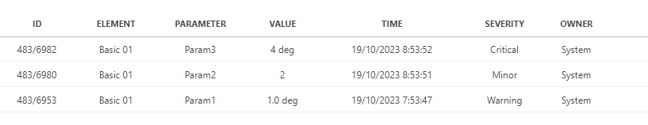
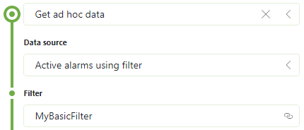

# Active alarms using filter

Retrieves the active alarms using a public filter.

This results in a table with multiple columns:

- ID
  - A string column identifying the DataMiner ID and alarm ID.
- Element name
  - A string column identifying name of the element on which the alarm occurred.
- Parameter name
  - A string column identifying name of the parameter on which the alarm occurred.
- Display value
  - A string column identifying display value of the parameter.
- Time
  - A date column identifying the creation time of the alarm.
- Severity
  - A string column identifying the severity of the alarm.
- Owner
  - A string column identifying the owner of the alarm.

## Arguments

This data sources comes with 1 argument:

- Filter: The name of the public alarm filter.

